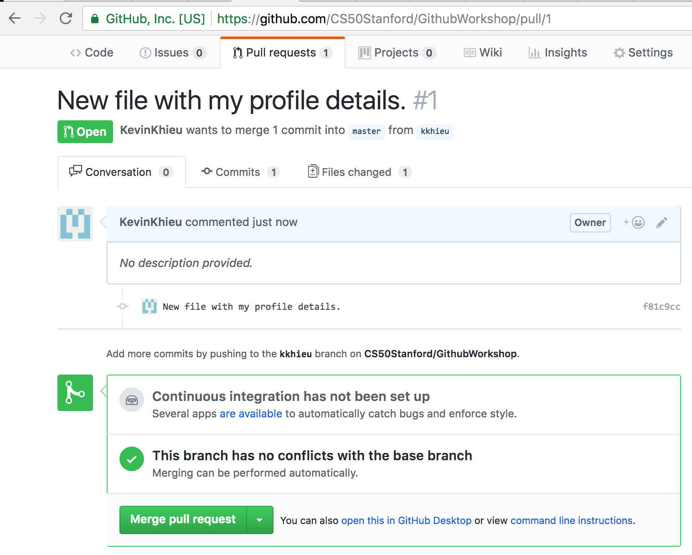
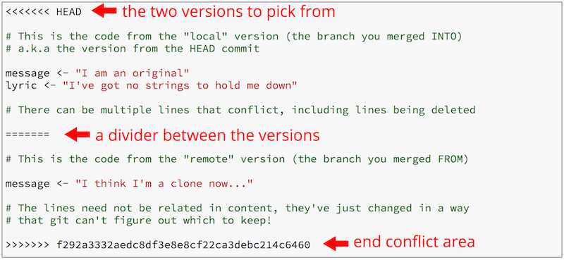

# Github Workshop
Welcome to your first workshop of CS50! Here, you'll learn how to use Github, a version control system that allows for teams to concurrently work on the same code efficiently. Knowing how to use Github will be important both for this class and for a lot of future software development you'll do in the future. Let's get started!

## Getting Started
### What is Github?
GitHub is a code hosting platform for version control and collaboration. It lets you and others work together on projects without always having to be in the same place.

This tutorial will teach you GitHub essentials like repositories, branches, commits, and pull requests. You’ll create your own Hello World repository and learn GitHub’s Pull Request workflow, a popular way to create and review code. The tutorial relies on using the command line interface, but all of these tasks can also be done without using the command line.

### Setup Instructions
To follow along this tutorial, you need to have **(1) a Github account** and **(2) Install Git on your computer/machine**. If you choose not to install Git on your machine, refer to the slides on how to use Git without the command line!

#### 1. Getting a Github Account
Navigating to www.github.com will lead you to the Github home page where you can sign up for an account. When signing up, choose the **free** personal plan option, which will let you create unlimited public repositories. Later in this guide, we walk you through how to activate your snazzy **student package**.

#### 2. Installing Git
For this step, it is easiest if you just refer to Github's default setup article: https://help.github.com/articles/set-up-git/

Follow the instructions for:
- Downloading/Installing the lastest version of Git,
- Setting your username globally in Git, and
- Setting your email globally in Git

After doing this step, you should be able to type "git" into your command line and get meaningful output. You're all set!
```
git
```
## The Tutorial
### 1. Repositories
A repository is usually used to organize a single project. Repositories can contain folders and files, images, videos, spreadsheets, and data sets – anything your project needs. Typically, these repositories, or repos, will be used to house all the code + necessary materials for your project.
#### Cloning This Repository
This workshop will revolve around you (and everyone else) playing with this repository. To get started, you'll need to **clone** this repository on your machine. Think about cloning a repository as downloading a copy of that repo onto your local machine that you can push to, pull from, and edit. To clone a repo:
1. Create an empty folder somewhere on your machine
2. Navigate to that folder using your command line/Terminal
3. Once inside that folder, type:
```
git clone https://github.com/CS50Stanford/GithubWorkshop.git
```
4. That creates a folder titled "GithubWorkshop". Lastly, navigate into that folder: 
```
cd GithubWorkshop
```

#### (Optional) Creating your own new repository
Cloning repos are nice, but say you want to start your own new project. Here's how you'd make your own repo:
1. In the upper right corner, next to your avatar or identicon, click the **+** and then select **New Repository**.
2. Name your repository.
3. Write a short description.
4. Select Initialize this repository with a README.
5. Click **Create Repository**

### 2. Branches
Branching is the way to work on different versions of a repository at one time. By default, every repository has one branch named *master* which is considered to be the definitive branch. We use other branches to experiment and make edits before *committing* them to master. In other words, think of the *master* branch as the branch that's meant to always be stable at any given time. Every other branch is used to experiment with creating new features, fixing bugs, etc... Once those features are fully implemented, you *merge* them into master to make them a part of the final product.

**Note:** You'll see that some teams don't use branches and instead just commit everything to master. This is typically considered bad practice since it means you have a higher risk of messing up the master branch, which is BAD and hence not recommended. If you choose to do this approach, be very careful!

#### Creating a Branch
Lets create your first branch off of master: 
```
git checkout -b YOUR_BRANCH_NAME
```

After doing that, you should get a message saying "Switched to a new branch 'YOUR_BRANCH_NAME'"! This means you've created your first branch! You can verify this by typing:

```
git branch
```

Which will list all branches related to your local machine, with an asterisk next to the branch you are currently on.

You can play around with jumping between branches by doing: 
```
git checkout master
```
which will switch you back to master, or *git checkout YOUR_BRANCH_NAME*, which will switch you back to your branch. Make sure to not include the -b! That will end up creating a new local branch!

#### What just happened?
When you create a branch in your project, you're creating an environment where you can try out new ideas. Changes you make on a branch don't affect the master branch, so you're free to experiment and commit changes here, safe in the knowledge that your branch won't be merged until it's ready to be reviewed by someone you're collaborating with.

As a note, this branch you just created won't actually persist in your actual Github directory until you make your first **push**.

#### Creating a new file
As a test, let's create a new file. 

1. Type: *vim yourfullname.txt* to create a text file.
2. In the file, type your name, year, major, CS50 Team, and two fun facts about yourself. Make them cool!
3. After you're done, save and exit by typing: *:wq*

*Note: The above 3 steps could've been done by also just creating a text file in whatever usual manner you create text files in. You don't have to use vim :)*

#### Committing your changes
Great! You've created a file, but this file only exists locally. How do we push it to your branch?

First, we check the *status* of our branch to see what files are/aren't currently being tracked by Git.
```
git status
```
After typing this, you should see your newly created file listed as being "untracked". This means that when you choose to commit/push changes on your branch, any work you do in this file will not be included! Let's fix that by *adding* this file to the list of files Git will track.
```
git add yourfullname.txt
```
Typing *git status* again will show your file again, but this time not listed as untracked! Instead, git status says you have changes in this file that need to be committed. Let's do that.
```
git commit -m "Type a descriptive but not too long commit message here"
```
When committing files, you want to make sure you include a somewhat descriptive message about what you're committing. This is to ensure that if you need to revert to previous commits, that you know what each commit "did".

#### Pushing!
Now **ASSUMING YOUR BRANCH IS UP TO DATE**, you can push your code! First, verify that you are on the correct branch (NOT MASTER):
```
git branch
```

and then push:
```
git push
```
If this is your first push, you'll get an error message saying there is no "upstream branch". This is because when you did *git checkout -b YOUR_BRANCH_NAME*, you created a local remote branch that only existed on your computer. To make this branch persist, just follow the instructions they tell us to do:
```
git push --set-upstream origin YOUR_BRANCH_NAME
```
You might be asked to provide your Github username and passcode. Once you've done that, you will have successfully made your first push! You can verify this by going to github.com/CS50Stanford/GithubWorkshop/ and checking to see that your branch is listed under the dropdown titled "branch: master" (next to the *New Pull Request* button).

And with that, you've done it! You made your first push to your branch on master.

#### Creating a Pull Request
Now that we have updated our branch by pushing, what if we want our changes to be reflected on the *master* branch? As a reminder, the *master* branch needs to always be in a stable/deployable state. Because of this, whenever we want to merge changes from a feature branch to the *master* branch, we want to always create a request so that others can *review* our changes before updating master.

https://help.github.com/articles/creating-a-pull-request/

The above link is the best, most straightforward way to learn how to create a pull request. It's very easy and is all done on the Github website!

#### Merging your Pull Request to Master
Note: This step is *supposed* to be done by another member of your team. However for this tutorial, just merge your own pull request to master. Just be very careful!

After creating your pull request, you should see this screen. What's important to note is the green checkmark next to the "This branch has no conflicts with the base branch". This means that merging your branch to master will not create any code conflicts! If this is the case, you should be okay with merging to Master. If you wanted to be absolutely sure, you can click on the "Files Changed" tab to review changes before merging.



When you're ready, click the *Merge Pull Request* button. Viola! You've successfully made a change and merged it to master! Congratulations!!!

### More Important Pointers
Congratulations! You've successfully created a Github account, cloned a repository, made a new file, committed that file, pushed it, and merged it to master. Woooo!

There are a few other things to touch upon, however, that will be important in your development process. These are **Pulling**, **Merging from Master**, and **Merge Conflicts**.

#### 1. "Pull Before You Push"
Before you push any code to a branch, you always want to make sure that the code you're pushing is up to date with the branch you're pushing to. There may be more than one person working on the branch you're working on, and you always want to make sure that the code your pushing has all the changes that've been pushed up to that point. To do this, we want to *pull* any new changes that've been made to your branch since the last time you pulled/cloned the branch. **We want to make this *pull* right before we *push***.
```
git pull
```
This command is important! It will pull all new changes from your current branch that have been made since the last time you pulled/cloned. Once you pull, always make sure to test your code + to fix any conflicts that may arise. Once you do this, you can go through the process of safely adding, committing, and pushing your code :)

#### 2. Pulling and Merging from Master 
In this tutorial, we made all of our changes while working on an isolated *branch*. It's great that we just pulled all the changes from our branch, but what if the master branch changes while we're working on our feature branch? In this case, we want to make sure that all changes to master are reflected in our feature branch (otherwise we'd be working on an old product!).

1. First, we need to checkout to the *master branch*.
```
git checkout master
```
2. Then we pull, which will pull all new changes made to the master branch since the last time we pulled/cloned.
```
git pull
```
3. Then we checkout back to our branch (again, do not do -b!)
```
git checkout YOUR_BRANCH_NAME
```
4. And lastly, we merge the updates to master into our branch.
```
git merge master
```

**Important:** Whenever something changes in the *master* branch, you should almost always pull from master and merge to your branch. The only time you should not do this is if merging from *master* would mess up the work you're doing.

#### 3. Merge Conflicts
Sometimes when you do the above steps, Github will throw a bunch of errors. These are called **Merge Conflicts**, and are scary to see but easy to fix if you know how :)

Upon seeing the list of conflicts, you'll want to navigate into each file that has a conflict. There, if you look around, you'll see something like this:



In short, a merge conflict occurs when two people edit the same area of code. In this case, Github does not know how to decide which peoples' code should persist. Github's solution is to make you, the developer, figure that out.

A merge conflict separates the two conflicting versions - after seeing this, you simply need to decide which code to keep/which code to throw away. After that (and after removing all the junk in the file), you want to save, re-commit, and repeat the process of merging until you get no conflicts. After that, you can push!
